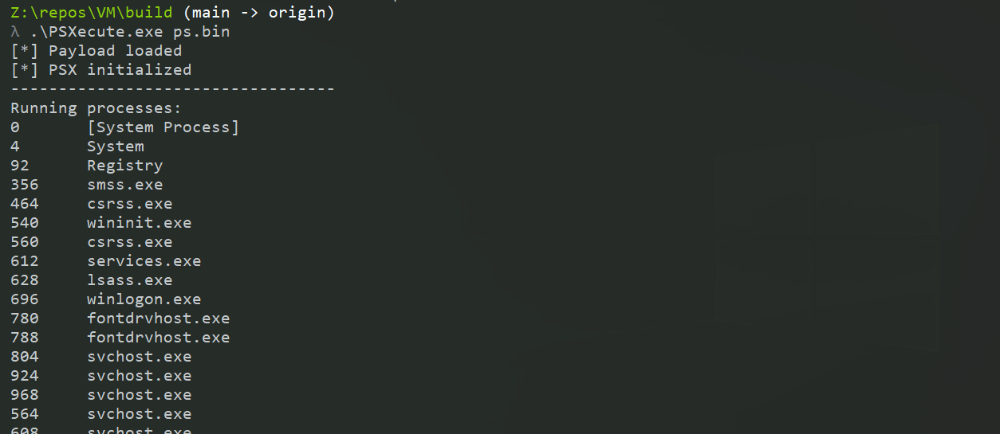

# PSXecute

32bit MIPS I emulator. Why 32 bit? Because this is a repurposed version of a [PlayStation 1 (PSX) emulator](https://github.com/eversinc33/YA-PSX-EMU) I started writing a few years ago, and the PSX runs 32 bit MIPS I. I equipped it with a syscall bridge to send strings to the host and call external apis from arbitrary DLLs, which makes it possible to execute payloads in the emulated memory, without the need to allocate any additional executable memory on the host. 

A collection of LLVM passes in [/Transpiler/passes](./Transpiler/passes) enable a payload to be written in "normal" C with e.g. Windows headers included. The payload is then compiled to LLVM bitcode, function calls are replaced with calls to the emulator's syscall-bridge, the bitcode is retargeted to MIPS and then compiled and linked to an ELF. Finally, the .text section is extracted and the resulting shellcode can be executed using the [VM](./VM). 

An example payload to get the current username and domain and print it to the host would look like this:

```c
#include <windows.h>
#define SECURITY_WIN32
#include <security.h>
#include <stdio.h>

#define NAM_SAM_COMPAT 2

#include "psxecute.h"

int start()
{
    char* fullName = (char*)malloc(256);
    unsigned long fullNameLen = 256;
    GetUserNameExA(NAM_SAM_COMPAT, fullName, &fullNameLen);
    PSX_PRINTF_1("%s\n", fullName);
    return 0;
}
```

Example payloads are available in [/Payload/examples/](./Payload/examples):

| Example | Src |
| --- | --- |
| Create a process | [createprocess.c](./Payload/examples/createprocess/createprocess.c) |
| Whoami | [whoami.c](./Payload/examples/whoami/whoami.c) |
| Pop a msgbox | [msgbox.c](./Payload/examples/msgbox/msgbox.c) |
| List running processes | [ps.c](./Payload/examples/ps/ps.c) |
| List directories | [dir.c](./Payload/examples/dir/dir.c) |
| Get OS info | [osinfo.c](./Payload/examples/osinfo/osinfo.c) |

Running the `ps` module:



# Installation and Usage

The compilation will likely only work from Linux, tested on Debian. You need `llvm` and a `mipsel-unknown-linux-gnu` toolchain to do the final linking. I used [crosstool-ng](https://github.com/crosstool-ng/crosstool-ng) to generate the latter.

### Compiling the VM

```bash
cd VM
mkdir build && cd build
cmake ..
make
```

### Compiling payloads

Edit `Payload/src/main.c` and hit `./compile.sh` in `Payload`.

You may need to compile the LLVM passes first:

```bash
cd Transpiler
./compile.sh
```

If you import a function from a DLL that is not present in [/Transpiler/dllmapping.h](./Transpiler/dllmapping.h) you need to add it and then recompile the passes (most functions should be there already though).

# Misc

I do not care about OPSEC or anything, if one needs that, one should inspect the shellcodes and see where there are improvements ;) this is just a fun project to show that it does not have to be RISC-V. With that being said, shout out to the [riscy business blogpost](https://secret.club/2023/12/24/riscy-business.html). I was sleeping on LLVM and initially hacked together a call bridge that wasn't ideal until I went the transpiler route. If you write your own offensive VM, I suppose you should do the same.
